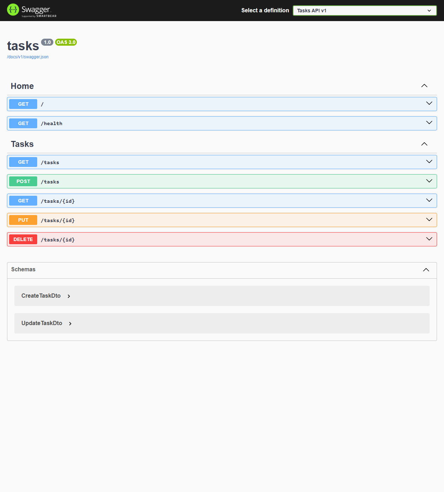

# Task API

FlyRank Internship — Backend AI Engineering — W2 · A1

A small REST API for managing a to-do list. Create, read, update and delete
tasks; the data lives in memory, so it disappears when the server stops.

Built with **ASP.NET Core on .NET 8**, using MVC controllers and an in-memory
repository registered as a singleton.

## Requirements

- [.NET SDK 8.0 or newer](https://dotnet.microsoft.com/download)

## Run

One command:

```bash
dotnet run --project tasks
```

The server starts on `http://localhost:5241`. Swagger UI is at
**<http://localhost:5241/docs>**.

> If `dotnet run` picks the HTTPS profile instead, either use the
> `https://localhost:7212` base URL, or add `--urls http://localhost:5241` to
> force plain HTTP. The documented commands below assume
> `http://localhost:5241`.

## Endpoints

| Method | Path          | Description                      | Success | Errors   |
| ------ | ------------- | -------------------------------- | ------- | -------- |
| GET    | `/`           | API name, version, main endpoint | 200     |          |
| GET    | `/health`     | Liveness check                   | 200     |          |
| GET    | `/tasks`      | List all tasks                   | 200     |          |
| GET    | `/tasks/{id}` | Get one task by id               | 200     | 404      |
| POST   | `/tasks`      | Create a task                    | 201     | 400      |
| PUT    | `/tasks/{id}` | Update a task                    | 200     | 400, 404 |
| DELETE | `/tasks/{id}` | Delete a task                    | 204     | 404      |

### Status codes

`200` read · `201` created · `204` deleted · `400` invalid body ·
`404` unknown id. Every error returns a JSON body such as
`{ "error": "Task 99 not found" }`.

## Example output

Create a task:

```console
$ curl -i -X POST http://localhost:5241/tasks \
    -H "Content-Type: application/json" \
    -d '{"title":"Buy milk"}'

HTTP/1.1 201 Created
Content-Type: application/json; charset=utf-8
Date: Tue, 29 Sep 2026 16:52:09 GMT
Server: Kestrel
Location: http://localhost:5241/tasks/4
Transfer-Encoding: chunked

{"id":4,"title":"Buy milk","isCompleted":false}
```

Ask for a task that does not exist:

```console
$ curl -i http://localhost:5241/tasks/99

HTTP/1.1 404 Not Found
Content-Type: application/json; charset=utf-8
Date: Tue, 29 Sep 2026 16:52:10 GMT
Server: Kestrel
Transfer-Encoding: chunked

{"error":"Task 99 not found"}
```

## Swagger UI



Every endpoint above is listed at `/docs` with a working **Try it out**
button, so the full CRUD cycle can be driven from the browser.

## Testing from the editor

`tasks/tasks.http` contains a ready-made request for every endpoint. In
Visual Studio, open the file and click the *send request* link above any
request; in Rider or VS Code, use a REST client extension.

## How it is put together

```
tasks/
  Controllers/
    HomeController.cs     GET / and GET /health
    TasksController.cs    GET, POST, PUT, DELETE on /tasks
  Models/
    TaskItem.cs           the task entity: Id, Title, IsCompleted
  Reposetry/
    IRepos/
      IRepoTaskItem.cs    storage interface
    Repos/
      RepoTaskItem.cs     in-memory list, seeded with 3 tasks
  Program.cs             wiring, Swagger, DI
  tasks.http             request collection
docs/
  swagger-ui.png         screenshot for this README
```

### Why the repository is a singleton

ASP.NET Core builds a **new controller instance for every request**, so a
plain instance field holding the task list would come back empty on each
call — POST a task, GET `/tasks`, and it would already be gone. Registering
`RepoTaskItem` as a singleton in `Program.cs` makes the list survive between
requests, which is the in-memory stand-in for a database.

## Storage

Tasks are held in a `List<TaskItem>` in memory, seeded with three examples.
Nothing is written to disk, and every task is lost when the server stops.
That is deliberate for this week — the exercise is to notice it, and to see
why a real application needs a database. That is what Week 3 adds.
